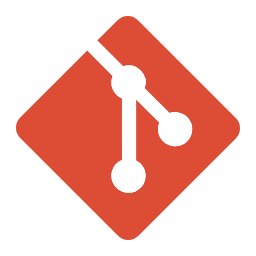

# About Us

The Health Research Authority (HRA) is committed to protecting and promoting the interests of patients and the public in health research. We work to ensure that health research is ethically reviewed and approved, and that it is conducted in a way that respects the rights, safety, dignity, and well-being of research participants.

# Research System Programme

We are currently rebuilding the Integrated Research Application System (IRAS) portal using Government Digital Service (GDS) standards and a microservice architecture. This modernization effort aims to enhance user experience, improve system reliability, and ensure scalability.

Our decision to rebuild the portal is driven by several key factors:

- **User Experience:** The current system has limitations that affect usability. By adopting GDS standards, we aim to create a more intuitive and user-friendly interface.
- **Performance and Scalability:** The existing architecture struggles with performance issues and cannot easily scale to meet growing demands. A microservice architecture will allow us to build a more robust and scalable system.
- **Security:** Modernizing the portal will enable us to implement the latest security best practices, ensuring the protection of sensitive data.
- **Compliance:** Adhering to GDS standards ensures that our system meets government requirements and best practices for digital services.

# Why Open Source?

We believe in the power of open-source development to foster innovation, collaboration, and transparency. By making our projects open-source, we aim to engage with the wider community, encourage contributions, and ensure that our work benefits from diverse perspectives and expertise.

Following GDS guidelines, we are committed to making our source code open and reusable. This approach allows others to benefit from our work, learn from our experiences, and contribute to the continuous improvement of our projects.

## Our Repositories

> Note: The actual code for our projects is hosted in Azure DevOps, not on GitHub.

Following is a high level overview of our repositories.

To explore the code and understand how you can contribute to our open-source projects, please use the repository link . This link will take you to the repository where you can browse the codebase and find detailed information in the README file.

The README includes guidelines on how to contribute, ensuring that you can effectively collaborate with other contributors and help improve the project. Your contributions are valuable, and we encourage you to review these guidelines to get started.

### Logging Package
---
It exposes methods for high performance logging, correlationId middleware,
request logging middleware. For high performance logging action and endpoint filters and logging interceptors.

> | <a href="https://dev.azure.com/FutureIRAS/Research%20Systems%20Programme/_git/rsp-logging-package">
Logging Package</a> | **Repo Name**: `rsp-logging-package`
---

### Iras Portal
---
Repository for the Integrated Research Application System (IRAS) portal, being rebuild using GDS standards and a microservice architecture. This repository contains the main UI for the portal, which communicates with various microservices to enhance user experience, performance, and security.

> | <a href="https://dev.azure.com/FutureIRAS/Research%20Systems%20Programme/_git/rsp-iras-portal">
 Iras Portal</a> | **Repo Name**: `rsp-iras-portal`
---

### User Management Microservice
---
Repository for the User Management microservice, which handles users, user claims, roles, and user roles using the Microsoft Identity database. This microservice ensures secure and efficient management of user identities and access control within the system.

> | <a href="https://dev.azure.com/FutureIRAS/Research%20Systems%20Programme/_git/rsp-usermanagement-service">
User Management Service</a> | **Repo Name**: `rsp-usermanagement-service`
---

### Research Application Microservice
---
Repository for the Research Application microservice, which manages the creation of research applications and the collection of questionnaire responses from users. This microservice ensures efficient handling and storage of application data and user responses, supporting the overall functionality of the IRAS portal.

> | <a href="https://dev.azure.com/FutureIRAS/Research%20Systems%20Programme/_git/rsp-iras-service">
Research Application Service</a> | **Repo Name**: `rsp-iras-service`
---

### Questionset Management Microservice
---
Repository for the Questionset Management microservice, which manages questionnaires, including possible answers and conditional rules for the questions. This microservice feeds the questions to the portal for making changes to research or creating amendments. The questions are stored and versioned centrally, ensuring dynamic and flexible questionnaire creation.

> | <a href="https://dev.azure.com/FutureIRAS/Research%20Systems%20Programme/_git/rsp-questionset-service">
Questionset Management Service</a> | **Repo Name**: `rsp-questionset-service`
---

&copy; Copyright HRA 2024 | [Contact us](https://www.hra.nhs.uk/about-us/contact-us/)

